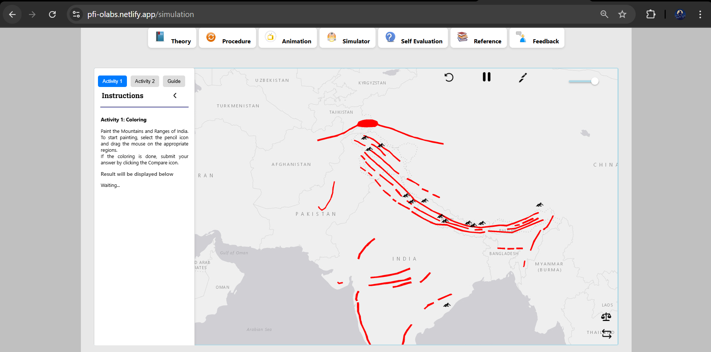

# 🌍 PFI - Physical Features of India

Visit the [PFI Web-Page](https://pfi-olabs.netlify.app)

An interactive **web application** showcasing the **physical features of India**, built for the **Olabs Hackathon** (Nov 2024 - Feb 2025).  
The platform combines geographical data with a user-friendly interface, providing an engaging and educational experience for users to explore India’s physical features.

Our team’s innovative approach and seamless execution earned us the **3rd Prize** in the hackathon competition.

---

## ✨ Features

- **Interactive Map**: Explore the physical features of India on an interactive map.
- **Geographical Data**: Learn about mountains, rivers, plateaus, and more.
- **Search and Filter**: Find specific physical features or explore by region.
- **Educational Content**: Each feature has detailed information to educate users.
- **Responsive Design**: Fully responsive to ensure a great experience across devices.

---

## 🛠️ Tech Stack

- **Frontend:** ReactJS
- **Backend:** Flask
- **Hosting:** Deployed on [Netlify](https://www.netlify.com) / [Heroku](https://www.heroku.com) / (Your hosting provider)

---

## 🖼️ Screenshots
| PFI Simulation Page |
| :---: |
|  |

---

## 🚀 Setup Instructions

### 1. Clone the Repository

```bash
git clone https://github.com/AddyDev555/PFI
npm install
npm run dev